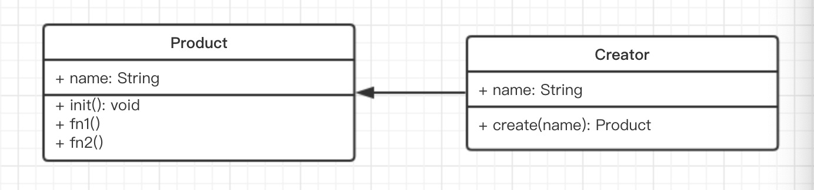

# SOLID五大设计原则
* S - 单一职责原则：一个程序只做好一件事，如果过于复杂就拆分，每个部分保持独立，要做到小而精，而不是大而全
* O - 开放封闭原则：对扩展开放，对修改封闭；增加需求时，扩展新代码，而非修改已有代码；软件设计的终极目标
* L - 李氏置换原则：继承中子类要覆盖父类；继承中父类能出现的地方，子类就能出现
* I - 接口独立原则：接口功能要单一，避免出现胖借口；不要让一个函数处理所有的逻辑
* D - 依赖导致原则：面向接口编程，依赖于抽象而不是依赖于具体；使用方只关注接口而不需要知道具体类的实现，接口已经定义好了输入和输出
 
# 23中设计模式：都是以满足五大设计原则的要求为目的
* 创建型 - 对象怎么创建生成
* 组合型（结构型） - 对象以及类通过神什么组合形式，达成既定的需求
* 行为型 - 涵盖了开发中的一些常用行为，这些常用行为该怎么去布置，才能满足设计原则的要求

# 工厂模式介绍
* 封装new操作，隐藏实例化对象的细节，不需要将具体构造函数提供给调用者使用。
* 常用于需要高频度调用构造函数的情况。

# 工厂模式优点
* 构造函数的改变不会影响到调用者
* 可以对对象的实例化做进一步的封装，比如参数验证，错误反馈等

# 工厂模式UML类图


# 工厂模式实现
``` bash
class Product {
  constructor (name) {
    this.name = name
  }
  init () {}
  fn1 () {}
  fn2 () {}
}

class Creator {
  // 封装new操作，隐藏实例化对象的细节，不需要将具体构造函数提供给调用者使用。
  create (name) {
    return new Product(name)
  }
}

const creator = new Creator()
// 不需要知道p1的构造函数，如果product需要被高频度的调用，则可以考虑工厂模式。
// 好处：一是构造函数的改变不会影响到调用者，二是可以对对象的实例化做进一步的封装，比如参数验证
const p1 = creator.create(p1)
p1.init()
p1.fn1()
p1.fn2()
```

# 工厂模式经典使用场景
* jQuery - $('div') 
* React.createElenent()
* vue 异步组件

1. jQuery - $('div') 
``` bash
class jQuery {
  constructor (selector) {
    let dom  = Array.from(document.querySelectorAll(selector))
    for (let i=0; i<dom.length; i++) {
      this[i] = dom[i]
    }
    this.length = dom.length
    this.selector = selector || ''
  }
  append () {}
  addClass () {}
  html () {}
}

window.$ = function (selector) {
  return new jQuery(selector)
}
# $('div') 和 new jQuery('div') 有何区别
# 对使用者开放统一的入口，不开放构造函数
# 构造函数和使用者隔离开，否则一旦构造函数名字发生变化，对调用者的影响将是灾难性的
```

2. React.createElenent()
``` bash
# const profile = <div>
#   
#   <h3>{[user.firstName, user.lastName].join(' ')}</h3>
# </div>

const profile = React.createElement('div', null, 
  React.createElement('img', {src: 'avatar.png', className: 'profile'}),
  React.createElement('h3', null, [user.firstName, user.lastName].join(' '))
)

class Vnode {
  constructor (tag, attrs, children) {
    // ...
  }
}

React.createElement = function (tag, attrs, children) {
  // 验证、错误反馈等
  return new Vnode(tag, attrs, children)
}

# React.createElement
# 是一个工厂函数，提供了统一的创建实例的入口
# 到底创建了什么实例调用者不清楚
# 只有看源码才知道是一个Vnode的实例

# 如果不使用工厂模式，直接吧Vnode类抛给使用者来使用有什么缺点？
# 1. 调用起来很麻烦
# 2. 验证、错误反馈等 都需要调用者来处理
# 3. 类名的改变，会对调用者产生重大的影响
```

3. vue 异步组件
``` bash
Vue.component('async-example', function (resolve, reject) {
  setTimeout(function () {
    resolve({
      template: '<div> I am async </div>'
    })
  }, 1000)
})
```

# 设计原则的验证
* 符合开放封闭原则：构造函数和创建者分离，开放了统一的入口，封闭了实现细节
* 符合依赖导致原则：面向于createElement，只关心产出的Vnode，而不需关心Vnode的实现细节

# 阅读经典库或框架源码的意义
* 学习如何实现功能 - 功能层次
* 学习设计思路 - 设计的层次
* 站在巨人的肩膀上创新